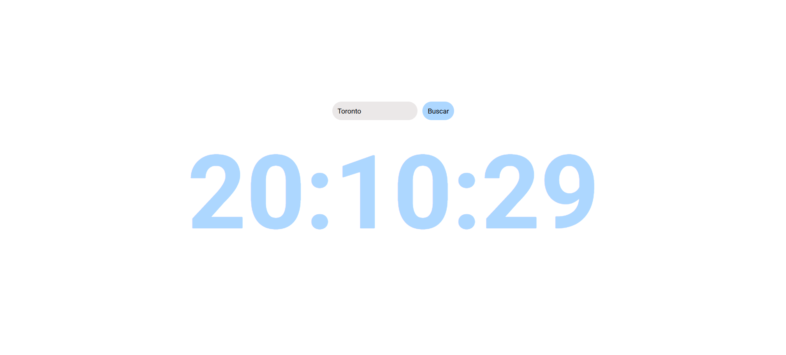

<h1>Relógio Virtual com Atualização de Segundos</h1>  

  

<h3>Descrição:</h3>

Este é um projeto simples de Relógio Virtual que permite ao usuário pesquisar uma cidade e ver a hora local em tempo real. A hora é buscada via API ipgeolocation.io e atualizada automaticamente a cada segundo na tela. O projeto é focado em iniciantes em JavaScript e HTML, mantendo a implementação simples e direta.

<h3>Funcionalidades:</h3>  

• Buscar a hora de qualquer cidade suportada pela API.  
• Mostrar a hora local em horas, minutos e segundos.  
• Atualização automática dos segundos.  
• Interface simples com input de cidade e botão de busca.  

<h3>Tecnologias Utilizadas:</h3>

• HTML5  
• CSS3  
• JavaScript (ES6)  

<h3>API externa:</h3>  

• ipgeolocation.io

Observação: Algumas cidades podem precisar do formato exato de timezone ou nome aceito pela API (America/Sao_Paulo, Asia/Tokyo, etc.).

Feito com 💙 por [Débora Iarcheski](https://www.linkedin.com/in/debora-iarcheski/)

